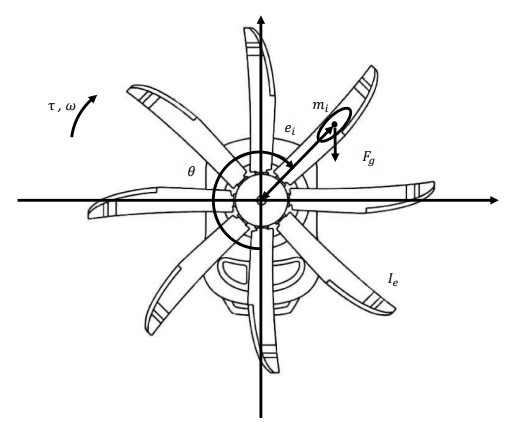

# Speed-control-of-an-axis-rotor-horizontal-with-deformation
Automatic Controls Project - Computer Engineering at Alma Mater Studiorum (University of Bologna)

## What is?
This is a university project created for the Automatic Controls course held by Professor Giuseppe Notarstefano at the University of Bologna. :books:

## Abstract
We want to build a controller to obtain an angular velocity ω that is constant over time despite
the deformation on one of the propeller blades that causes non-linearity.

  

## Development of the project 🕥
it is possible to see the entire development of the project, with the relative formulas and variables in the [report file](https://github.com/UniIdeas/Speed-control-of-an-axis-rotor-horizontal-with-deformation/blob/main/Report/RELAZIONE.pdf).
To consult the implementation code: open this [file](https://github.com/UniIdeas/Speed-control-of-an-axis-rotor-horizontal-with-deformation/blob/main/ProjectFiles/PROGETTO_gruppoE.m) on MatLab.

## Results
Bode diagram of the extends system with constraints:

  

Bode diagram of the L function:

  

Bode diagram of the Step Response function:

  

Controller design on Simulink:

  

Simulation with measurement noise:

  

Screenshot of the graphic animation:

  

## Credits 🫂
- [Davide Badini](https://github.com/UniIdeas)
- [Luca Berardi](https://github.com/LucaBerardi6)
- [Marco Motamed](https://github.com/MotaMarco)
- [Giuseppe Sergi](https://github.com/GiuseppeSergi3)
